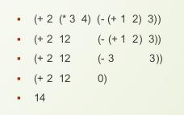

In this course we are gonna write our own programmation language.


### Interpreter 
***What is an interpreter ?***
> An interpreter is a computer program that is used to directly execute program instructions written using one of the many high-level programming languages. The interpreter transforms the high-level program into an intermediate language that it then executes, or it could parse the high-level source code and then performs the commands directly, which is done line by line or statement by statement.


### Compiler 
***what is a compiler ?***
>A compiler is a special program that translates a programming language's source code into machine code, bytecode or another programming language. The source code is typically written in a high-level, human-readable language such as Java or C++. A programmer writes the source code in a code editor or an integrated development environment IDE that includes an editor, saving the source code to one or more text files. A compiler that supports the source programming language reads the files, analyzes the code, and translates it into a format suitable for the target platform.


### Semantic 
***what is Semantic ?***
-   It refers to the meaning associated with the statement in a programming language.
-   It is all about the meaning of the statement which interprets the program easily.
-   Errors are handled at runtime .


### Syntax
***what is Syntax ?***
-   It refers to the rules and regulations for writing any statement in a programming language like C/C++.
-   It does not have to do anything with the meaning of the statement.
-   A statement is syntactically valid if it follows all the rules.
-   It is related to the grammar and structure of the language.

The difference between semantic and syntax  is the difference between the rules and the signification where the rules are the syntax and the signification  are the semantic .


*during the course we will build our own interpreter  in the tool/language racket*

Racket is an aggregation of a lot of programming language  ,  we are gonna use PL that is a lit version for students of racket , not all the documentation of racket is useful for PL.


### Imperative Language 
**what is Imperative language ?**
>An imperative programming language is a programming language that uses statements that change a program's state. Imperative languages are based on the idea of giving the computer a sequence of tasks to perform, using statements that change a program's state. Examples of imperative languages include C, C++, Java, and Python.

### Functional language 
**what is functional  language ?**
>A functional programming language is a programming language that uses mathematical functions to describe the behavior of the program. In functional programming, the output of a function depends only on its inputs, and there is no side effect that changes the state of the program. This makes functional programming well suited for tasks that can be parallelized and for code that is easy to reason about. Examples of functional programming languages include Haskell, Lisp, Scheme, and Erlang.

The racket language is both Imperative  and functional  it's called a multi-paradigm language .


### Basics of Racket/PL language

```rkt
#t    //true
#f    //false

eq?   x y     // check if the object x equal the object y 
equal? x y  //   check if the value of the object x equal the value of the object y 
string=?  "string1" "string2" //compare the value of the two strings
```
All the things in racket are Object 
[nice and simple docs for vars in racket with exemples](https://learnxinyminutes.com/docs/racket/)


---
# Tirgul-1

#### Basics Types
```racket 
#|
Booleans : true, false , #t , #f
Numbers : 1 , 0.5 , 1/2 , 1+2i
Strings : "apple"
Symbols : 'apple
Characteres : #\a , #\b
|#
```

#### Basic Operation 
```
(+ 2 1) ; =2+1
(- 2 1) ; =2-1
(string-append "a" "b") ; "ab"
```

#### How racket evaluate an expression



#### If statement in racket 
```racket
#|
(if <condition>
	<true case>
	<false case> )
|#
;exemple 
(if (< 2 3) 10 20) ; =10
```

#### cond statement  in racket 
```
#|
(cond 
	[<condition> <to do>]
	[<condition> <to do>]
	[...................]
	[<condition> <to do>]
	[else        <to do>])
|#

 ;exemple 
(cond 
	[(eq? 'a 'b) 0]
	[(eq? 'a 'c) 1]
	[else 2])

```

#### Define a const 
```racket
; (define <name> <expression> )
(define PI 3.14)
```

#### Declaration of function 
```racket
(: f : Number -> Number )
(define (f x)
	(* x(+ x 1)))
```

#### Define a function
```racket
; (define (<function_name> <arg1>... ) <expression>)

(define (Not a)
	(cond 
	[a #f]
	[else #t]))
	
```

#### Test declaration 
```racket
; (test (<got>) => <expected> )
(test (f 0) => 2)

```
